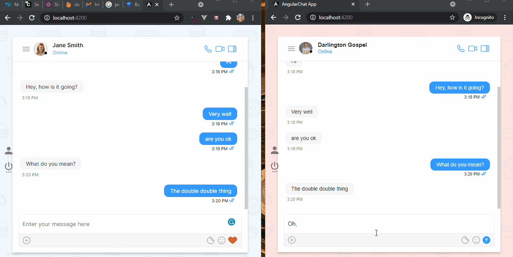

# Build One-on-One chat Angular app

This example shows How To Build One-on-One chat in your Angular app:


<figcaption>One-on-One Angular Chat App</figcaption>


## Technology
This demo uses:

* CometChat Pro 2.2.1
* CometChat Angular UI Kit
* Firebase
* Angular

## Running the demo

To run the demo follow these steps:

1. Select this newly added app from the list.
2. From the Quick Start copy the **APP_ID, APP_REGION and AUTH_KEY**. These will be used later.
3. Navigate to the Users tab, and delete all the default users and groups leaving it clean **(very important)**.
4. Get the Angular CLI installed on your machine by entering this command on your terminal.
  ```sh
  npm install -g @angular/cli
  ```
5. Run `git clone https://github.com/fagarcia086/chat-app.git` and open it in a code editor.
6. [Head to Firebase and create a new project](https://console.firebase.google.com)
7. Open the "environment.ts" and paste codes in the files as seen below.
  ```ts    
    import { firebaseConfig, cometChat } from './../../app.config'
    export const environment = {
    production: false,
    firebase: firebaseConfig,
    ...cometChat,
    };
  ```
8. Create a file called **app.config.ts** in the **src** folder of your project.
9. Import and inject your secret keys in the **app.config.ts** file containing your CometChat and Firebase in this manner.
  ```ts    
    // For Firebase JS SDK v7.20.0 and later, measurementId is optional
    const firebaseConfig = {
    apiKey: 'xxx-xxx-xxx-xxx-xxx-xxx-xxx-xxx',
    authDomain: 'xxx-xxx-xxx-xxx-xxx-xxx-xxx',
    databaseURL: 'xxx-xxx-xxx-xxx-xxx-xxx-xxx-xxx-xxx',
    projectId: 'xxx-xxx-xxx',
    storageBucket: 'xxx-xxx-xxx-xxx-xxx',
    messagingSenderId: 'xxx-xxx-xxx',
    appId: 'xxx-xxx-xxx-xxx-xxx-xxx-xxx-xxx',
    measurementId: 'xxx-xxx-xxx',
    };

    const cometChat = {
    APP_ID: 'xxx-xxx-xxx',
    AUTH_KEY: 'xxx-xxx-xxx-xxx-xxx-xxx-xxx-xxx',
    APP_REGION: 'xx',
    };

    export { firebaseConfig, cometChat }
  ```
10. Copy the same settings into the "environment.prod.ts" as well.
11. Make sure to exclude **app.config.ts** in your gitIgnore file from being exposed online.
12. Run the following command to install the CometChat SDK.

```sh
    npm install
    ng serve --open
```